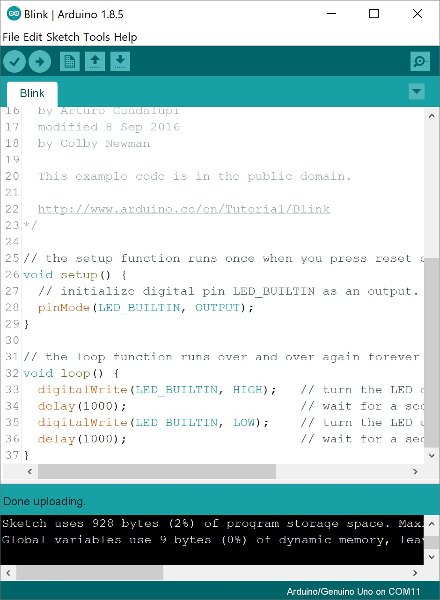

# OBSTACLE AVOIDING ROBOT
 Arduino Uno R3.

## IMAGE DEMO
<p align='center'>
</img>
</p>

## VIDEO DEMO
<div align='center'>

[](https://youtu.be/qB7ZH5Fhn2s)

</div>

## CODE DEMO
```c++
/// @brief Measure distance.
/// @return Distance.
int dokhoangcach()
{
    int kc;
    long tg;
    digitalWrite(TRIG, LOW);
    delayMicroseconds(2);
    digitalWrite(TRIG, HIGH);
    delayMicroseconds(10);
    digitalWrite(TRIG, LOW);
    tg = pulseIn(ECHO, HIGH, 3600000);
    kc = int(tg / 2 / 29.412);
    return kc;
}
```
